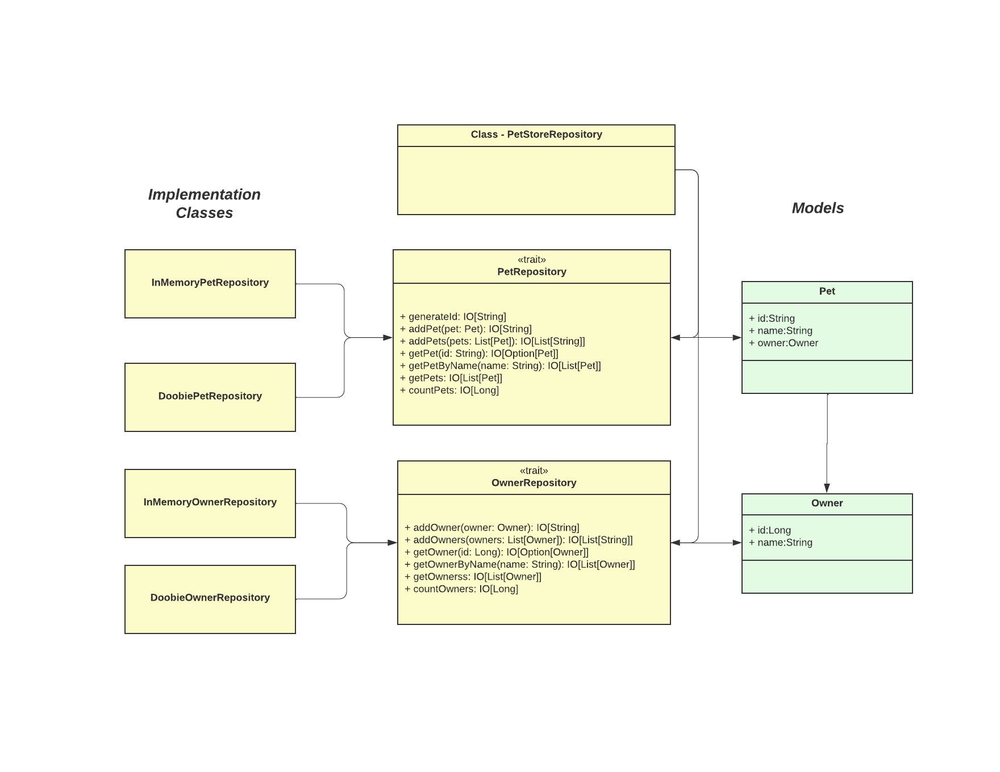

CATS Effect with Doobie - A Simple Example
==============================

# Introduction

This archive contains a template Sbt project for a Scala application. It includes [Scala Style](http://www.scalastyle.org/)
and [Scala format](https://scalameta.org/scalafmt/) configuration as well as the [Type safe configuration library](https://github.com/lightbend/config)
and [Logback logging](https://logback.qos.ch/).

